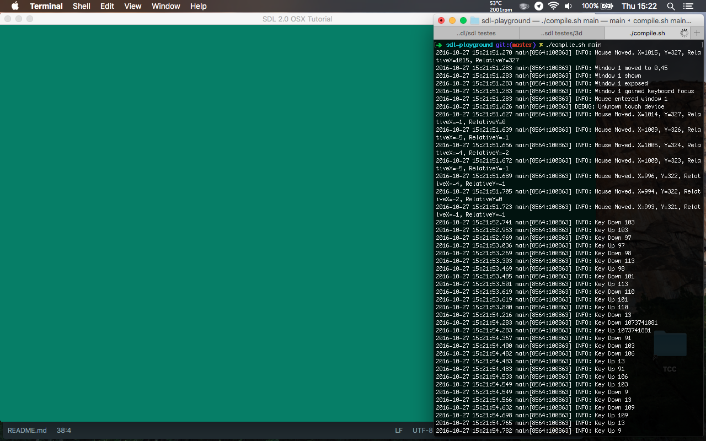

# sdl-playground
Some tests made to learn SDL + OpenGL

Everything from December 2014


## Dependences

- OpenGL 3.3
- C++11
- [SDL2](https://www.libsdl.org/download-2.0.php)
- [SDL2_image](https://www.libsdl.org/projects/SDL_image/)
- [SDL2_ttf](https://www.libsdl.org/projects/SDL_ttf/)
- [SDL2_mixer](https://www.libsdl.org/projects/SDL_mixer/)
- [GLM](http://glm.g-truc.net)
- [GLEW](http://glew.sourceforge.net)


## About

This was made on a MacBook Pro (mid 2012)
with an Intel HD 4000

Compiled over OS X Mavericks (2014)
and macOS Sierra (2016) with clang++

__Libraries installed with [HomeBrew](http://brew.sh)__

```sh
brew install sdl2 sdl2_image sdl2_ttf sdl2_mixer glm glew
```

#### Usage

```sh
chmod +x compile.sh
./compile.sh <filename>
# where `<filename>` can be
# p1 ~ p9 or main or playground
./compile.sh main
# to see a flashing screen with some inputs on terminal
```




## Thanks

- Tim Jones   
SDLTutorials.com   
https://github.com/MetaCipher/the-sdl-engine

- Benny   
https://github.com/BennyQBD/ModernOpenGLTutorial   
https://www.youtube.com/playlist?list=PLEETnX-uPtBUbVOok816vTl1K9vV1GgH5
